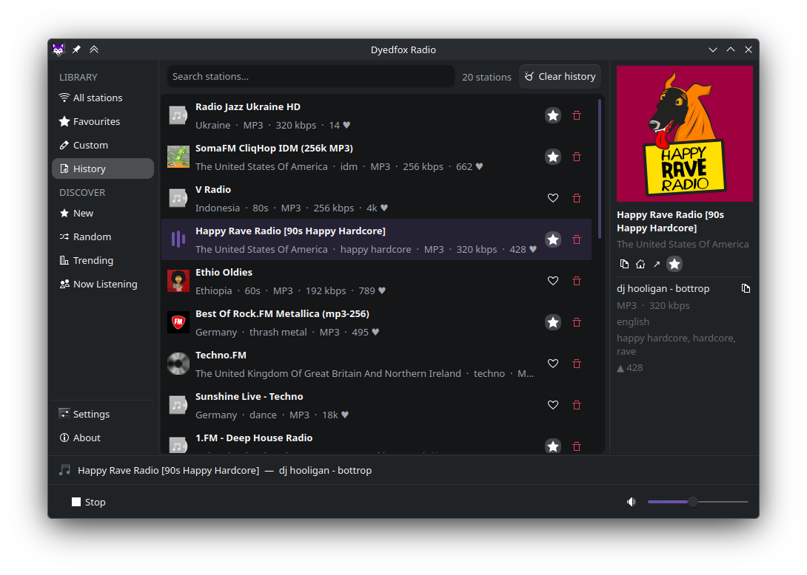
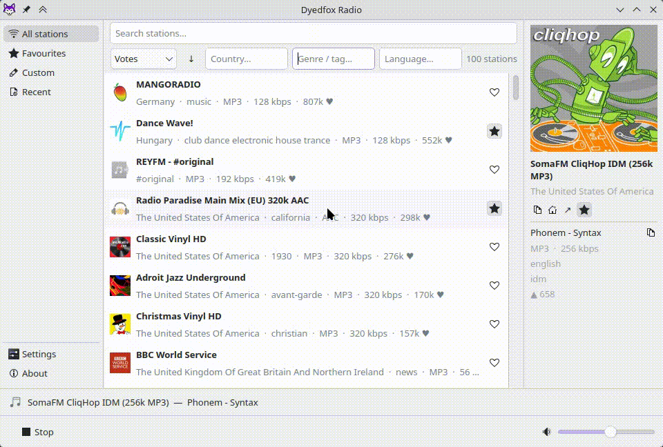

# Dyedfox Radio

Desktop internet radio player for KDE Plasma, powered by [radio-browser.info](https://www.radio-browser.info/).

Inspired by [Shortwave](https://github.com/maunalinux/shortwave), with a native KDE look using PyQt6.

## Contents

- [Screenshots](#screenshots)
- [Features](#features)
- [Keyboard Shortcuts](#keyboard-shortcuts)
- [Install on Arch Linux (AUR)](#install-on-arch-linux-aur)
- [Build from source (PKGBUILD)](#build-from-source-pkgbuild)
- [Install on other Linux distros](#install-on-other-linux-distros)
- [Manual installation](#manual-installation)
- [Known quirks](#known-quirks)
- [Localization](#localization)
- [Paths](#paths)
- [Dependencies](#dependencies)

## Screenshots






## Features

- Browse and search top stations from radio-browser.info
- Multi-keyword search across name, tags, country, and language
- Discover lists: New, Random, Trending, and Now Listening (what others are tuning into right now)
- Sort by name, country, bitrate, votes, language, or codec, and filter by country, tag, or language
- Favourites, History, and custom stations (add any stream by URL)
- Editable History — remove single stations or clear the whole list
- Station info panel with logo, codec, bitrate, and tags
- Per-song album art for the current track (looked up from Deezer, falls back to the station logo) — click the artwork to enlarge, or toggle between cover art and station logo
- Animated equalizer indicator on the playing station
- Now playing bar with song/artist from stream metadata
- Automatic reconnection with backoff when a stream drops
- System tray icon with play/stop context menu and middle-click toggle
- MPRIS2 support (media keys, KDE media player widget)
- Song change notifications
- Breeze light/dark theme support, following the system palette
- Persistent volume, favourites, and recent history

## Keyboard Shortcuts

| Shortcut | Action |
|---|---|
| `Ctrl+Q` | Quit |
| `Ctrl+W` | Minimize to tray |

## Install on Arch Linux (AUR)

```bash
yay -S dyedfox-radio
```

Or manually:

```bash
git clone https://aur.archlinux.org/dyedfox-radio.git
cd dyedfox-radio
makepkg -si
```

## Build from source (PKGBUILD)

Clone the repository and build from its root directory:

```bash
git clone https://github.com/dyedfox/dyedfox-radio.git
cd dyedfox-radio
makepkg -si
```

## Install on other Linux distros
(Debian 12+, Ubuntu 22.04+, Fedora)

```bash
git clone https://github.com/dyedfox/dyedfox-radio.git && cd dyedfox-radio && bash install.sh
```

Requires Python 3.10+, GStreamer, `python3-dbus`, and `python3-gi` from your distro's package manager.

To upgrade, pull the latest changes and re-run the script.

If you already have the repository cloned locally:

```bash
cd dyedfox-radio
git pull
bash install.sh
```

Otherwise, clone it first:

```bash
git clone https://github.com/dyedfox/dyedfox-radio.git
cd dyedfox-radio
bash install.sh
```

To uninstall:

```bash
bash install.sh uninstall
```


## Manual installation

**1. Install dependencies** using your distro's package manager. You need:
- Python 3.10+
- PyQt6
- python-requests
- python-dbus
- python-gobject
- GStreamer + gst-plugins-base + gst-plugins-good

**2. Copy application files:**

```bash
sudo mkdir -p /usr/lib/dyedfox-radio/translations
sudo cp -r api data player tray ui assets main.py /usr/lib/dyedfox-radio/
sudo cp translations/*.qm /usr/lib/dyedfox-radio/translations/
sudo cp assets/icons/dyedfox-radio.png /usr/share/icons/hicolor/256x256/apps/
sudo cp assets/icons/dyedfox-radio-tray.svg /usr/share/icons/hicolor/scalable/apps/
sudo cp dyedfox-radio.desktop /usr/share/applications/
```

**3. Create a launcher:**

```bash
echo -e '#!/bin/sh\nexec python3 /usr/lib/dyedfox-radio/main.py "$@"' | sudo tee /usr/bin/dyedfox-radio > /dev/null
sudo chmod 755 /usr/bin/dyedfox-radio
```

## Known quirks

- **Bluetooth on cold start:** if you connect a Bluetooth device while playback is stopped, the next stream may start on your previous output — switch it in KDE's audio menu (tray → speaker icon) or simply restart the app. Streams already playing follow Bluetooth automatically. This is a side effect of defaulting to the PulseAudio output (`pulsesink`), which we prefer for reliable sound across distros that don't ship the native PipeWire GStreamer plugin.

## Localization

The UI language follows your system locale automatically.

| Locale | Language | Translator | Status |
|---|---|---|---|
| `uk_UA` | Ukrainian | [dyedfox](https://github.com/dyedfox) | ✓ reviewed |
| `nl_NL` | Dutch | [Heimen Stoffels (Vistaus)](https://github.com/Vistaus) | ✓ reviewed |
| `bg_BG` | Bulgarian | machine-generated | ⚙ unreviewed |
| `ca_ES` | Catalan | machine-generated | ⚙ unreviewed |
| `cs_CZ` | Czech | machine-generated | ⚙ unreviewed |
| `da_DK` | Danish | machine-generated | ⚙ unreviewed |
| `de_DE` | German | machine-generated | ⚙ unreviewed |
| `el_GR` | Greek | machine-generated | ⚙ unreviewed |
| `es_ES` | Spanish | machine-generated | ⚙ unreviewed |
| `et_EE` | Estonian | machine-generated | ⚙ unreviewed |
| `fi_FI` | Finnish | machine-generated | ⚙ unreviewed |
| `fr_FR` | French | machine-generated | ⚙ unreviewed |
| `hr_HR` | Croatian | machine-generated | ⚙ unreviewed |
| `hu_HU` | Hungarian | machine-generated | ⚙ unreviewed |
| `it_IT` | Italian | machine-generated | ⚙ unreviewed |
| `lt_LT` | Lithuanian | machine-generated | ⚙ unreviewed |
| `lv_LV` | Latvian | machine-generated | ⚙ unreviewed |
| `nb_NO` | Norwegian Bokmål | machine-generated | ⚙ unreviewed |
| `pl_PL` | Polish | machine-generated | ⚙ unreviewed |
| `pt_PT` | Portuguese | machine-generated | ⚙ unreviewed |
| `ro_RO` | Romanian | machine-generated | ⚙ unreviewed |
| `sk_SK` | Slovak | machine-generated | ⚙ unreviewed |
| `sl_SI` | Slovenian | machine-generated | ⚙ unreviewed |
| `sr_RS` | Serbian (Cyrillic) | machine-generated | ⚙ unreviewed |
| `sv_SE` | Swedish | machine-generated | ⚙ unreviewed |

> **Note:** Locales marked ⚙ were machine-generated to give each language a starting
> point and have **not** been reviewed by a native speaker. They may contain awkward
> phrasing or mistakes. Corrections are very welcome — please send them in accordance
> with [translations/TRANSLATING.md](translations/TRANSLATING.md).

More languages are welcome too — see [translations/TRANSLATING.md](translations/TRANSLATING.md) to contribute.

## Paths
After installation the following files are placed automatically:

- `/usr/bin/dyedfox-radio` — launcher script
- `/usr/lib/dyedfox-radio/` — application files
- `/usr/share/applications/dyedfox-radio.desktop` — desktop entry
- `/usr/share/icons/hicolor/256x256/apps/dyedfox-radio.png` — app icon
- `/usr/share/icons/hicolor/scalable/apps/dyedfox-radio-tray.svg` — tray icon

## Dependencies

| Package | Purpose |
|---|---|
| `python` | Runtime |
| `python-pyqt6` | UI framework |
| `python-requests` | API calls |
| `python-dbus` | MPRIS2 integration |
| `python-gobject` | GStreamer bindings |
| `gstreamer` | Audio playback |
| `gst-plugins-base` | Core GStreamer plugins |
| `gst-plugins-good` | Common codec support |
| `gst-plugins-bad` *(optional)* | Additional codec support |
| `gst-libav` *(optional)* | AAC and other codecs |
