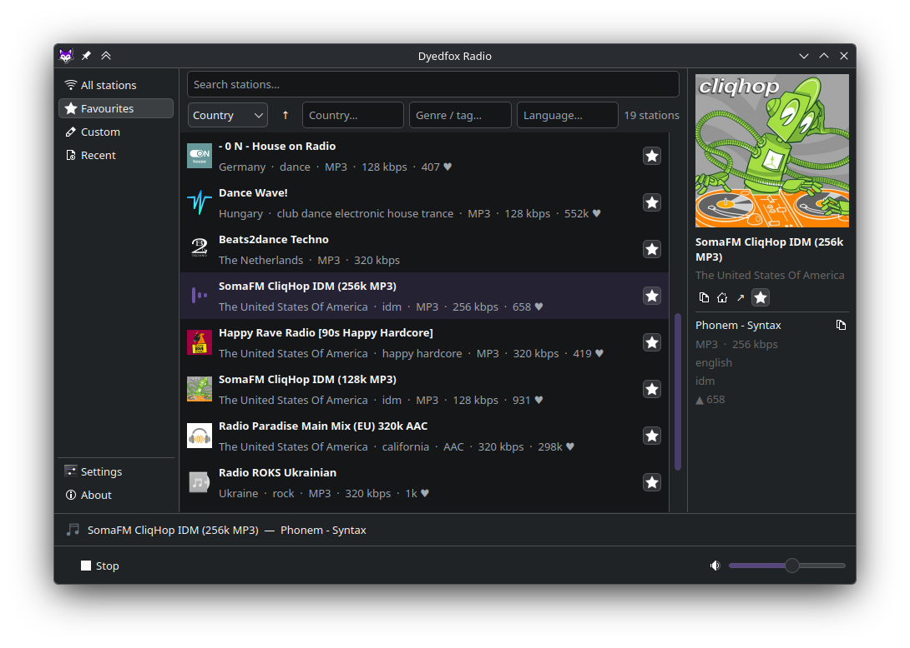
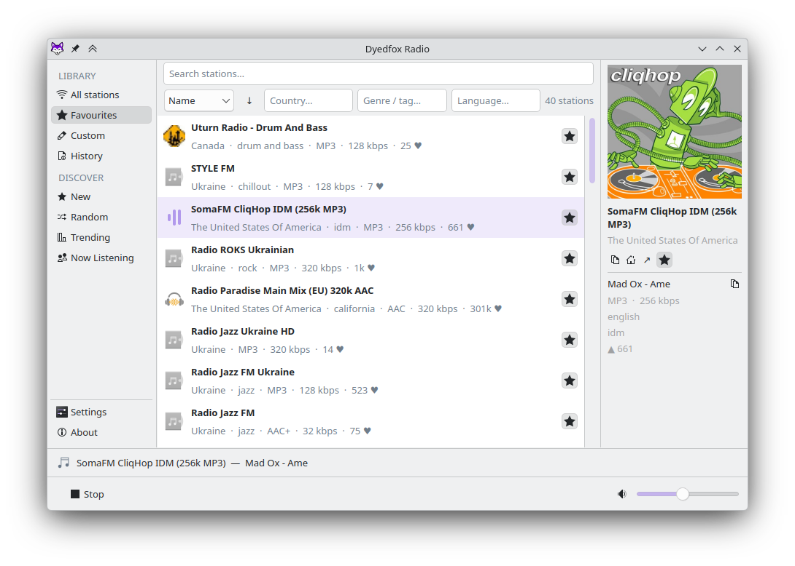
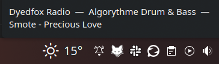
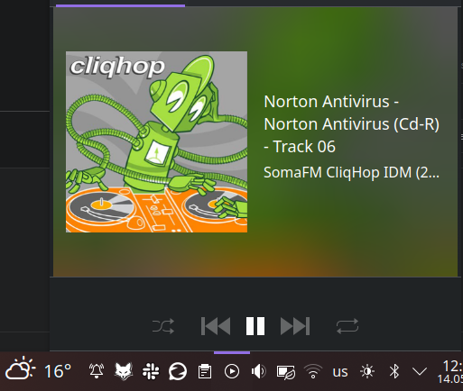

# Dyedfox Radio

Desktop internet radio player for KDE Plasma, powered by [radio-browser.info](https://www.radio-browser.info/).

Inspired by [Shortwave](https://github.com/maunalinux/shortwave), with a native KDE look using PyQt6.

## Contents

- [Screenshots](#screenshots)
- [Features](#features)
- [Keyboard Shortcuts](#keyboard-shortcuts)
- [Install on Arch Linux (AUR)](#install-on-arch-linux-aur)
- [Build from source (PKGBUILD)](#build-from-source-pkgbuild)
- [Install on other Linux distros](#install-on-other-linux-distros)
- [Paths](#paths)
- [Dependencies](#dependencies)

## Screenshots






## Features

- Browse and search top stations from radio-browser.info
- Multi-keyword search across name, tags, country, and language
- Favourites, recently played, and custom stations (add any stream by URL)
- Station info panel with logo, codec, bitrate, and tags
- Animated equalizer indicator on the playing station
- Now playing bar with song/artist from stream metadata
- System tray icon with play/stop context menu and middle-click toggle
- MPRIS2 support (media keys, KDE media player widget)
- Song change notifications
- Persistent volume, favourites, and recent history

## Keyboard Shortcuts

| Shortcut | Action |
|---|---|
| `Ctrl+Q` | Quit |
| `Ctrl+W` | Minimize to tray |

## Install on Arch Linux (AUR)

```bash
yay -S dyedfox-radio
```

Or manually:

```bash
git clone https://aur.archlinux.org/dyedfox-radio.git
cd dyedfox-radio
makepkg -si
```

## Build from source (PKGBUILD)

Clone the repository and build from its root directory:

```bash
git clone https://github.com/dyedfox/dyedfox-radio.git
cd dyedfox-radio
makepkg -si
```

## Install on other Linux distros
(Debian/Ubuntu, Fedora)

```bash
git clone https://github.com/dyedfox/dyedfox-radio.git && cd dyedfox-radio && bash install.sh
```

Requires Python 3.10+, GStreamer, `python3-dbus`, and `python3-gi` from your distro's package manager.

To upgrade, just run the script again — it replaces the previous installation cleanly:

```bash
bash install.sh
```

To uninstall:

```bash
bash install.sh uninstall
```


## Paths
After installation the following files are placed automatically:

- `/usr/bin/dyedfox-radio` — launcher script
- `/usr/lib/dyedfox-radio/` — application files
- `/usr/share/applications/dyedfox-radio.desktop` — desktop entry
- `/usr/share/icons/hicolor/256x256/apps/dyedfox-radio.png` — app icon
- `/usr/share/icons/hicolor/scalable/apps/dyedfox-radio-tray.svg` — tray icon

## Dependencies

| Package | Purpose |
|---|---|
| `python` | Runtime |
| `python-pyqt6` | UI framework |
| `python-requests` | API calls |
| `python-dbus` | MPRIS2 integration |
| `python-gobject` | GStreamer bindings |
| `gstreamer` | Audio playback |
| `gst-plugins-base` | Core GStreamer plugins |
| `gst-plugins-good` | Common codec support |
| `gst-plugins-bad` *(optional)* | Additional codec support |
| `gst-libav` *(optional)* | AAC and other codecs |
